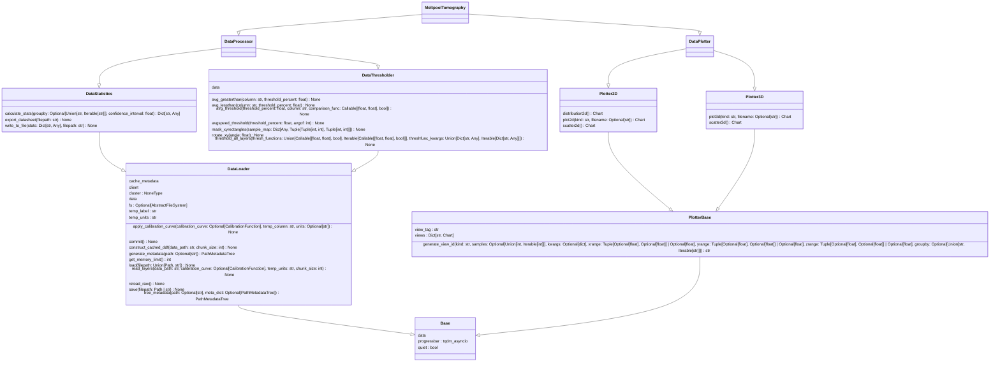

# MTPy

## Overview

A python based tool for Meltpool Tomography. Currently very much a work in progress. In the process of being refactored, reorganized, and redesigned a little to turn it from a draft tool into a more polished and useful library ready to be rolled out to the broader community.

## Progress Notes

- Reorganized into more sane file tree
- Converted `Base` class to `BaseProtocol` protocol
- Implemented `vis` protocol and ABC
- Implemented rough `loaders` protocol and ABC
- Problem w/ libstdc++ due to using nixos? preventing import of dask.dataframe

NOTE FOR RETURNING TO THIS:
Currently, have implemented type guard to try and constrain the progressbar.
However, this isn't working because it is constraining to an instance instead
of a class. Need to figure out how to constrain to a class (not an instance)
that implements a protocol.

## Todo

- [x] reorganize project folder structure (proper /src directory, etc)
- [x] implement mypy type annotations to enforce types and prevent errors
- [x] add missing docstrings, conforming to a standard (currently using google convention)
- [x] add automated UML generation
- [ ] add tests using pytest and hypothesis
- [x] add git hooks (e.g: format every commit with black/ruff  and check with mypy before pushing)
- [x] add proper debug logging
- [ ] add debug messages
- [x] add proper user feedback mechanism
- [x] Refactor and implement patterns where appropriate
- [ ] use `__init__.py` to simplify API
- [ ] ~~clean up namespaces with config files?~~ <- Unnecessary. Restructure made the API more sensible.
- [x] add automated documentation via mkdocs (and remove sphinx docs)
- [ ] implement a CLI for basic functions
- [ ] rewrite experimental GUI using flet
- [ ] implement Dask GPU support
- [ ] Add a dashboard using dash
- [ ] Add raster detection component as processor
- [ ] fix 3d tomography visualizations (see in-progress project)
- [x] clean up project in general
    - [x] remove unused files
    - [x] remove old code
    - [x] Replace old constructs (e.g: `typing.Union`) with more modern versions
    - [x] Update dependencies

## Subprojects

### Loosen class couplings

- [x] Properly plan new UML
- [x] Create abstract classes/interfaces
- [x] Decouple main classes
- [x] Implement logger according to a protocol
- [x] Implement progress bars according to a protocol
- [ ] Create dummy modules for each class

### Create proper testing regime

- [ ] Create testing modules conforming to protocols
    - Might make sense for testing modules to be wrappers around hypothesis generators?
- Implement tests using:
    - [ ] Traditional scripted testing (e.g: pytest)
    - [ ] Property based testing (hypothesis)

Note: This project is an absolute mess right now, i need to remember to make sure i branch each subsection of this work in git to manage it properly.

## Project UML

