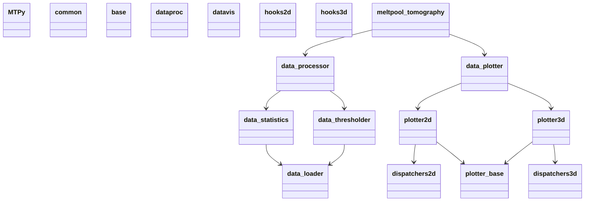

# MTPy

## Overview

A python based tool for Meltpool Tomography. Currently very much a work in progress. In the process of being refactored, reorganized, and redesigned a little to turn it from a draft tool into a more polished and useful library ready to be rolled out to the broader community.

## Todo

[X] reorganize project folder structure (proper /src directory, etc)\
[X] implement mypy type annotations to enforce types and prevent errors\
[X] add missing docstrings, conforming to a standard (currently using google convention)\
[X] add automated UML generation\
[ ] add tests using pytest and hypothesis\
[X] add git hooks (e.g: format every commit with black/ruff  and check with mypy before pushing)\
[ ] ~~add proper debug logging~~ <- This need is probably better addressed by [`snoop`](https://github.com/alexmojaki/snoop)\
[ ] REFACTOR AND IMPLEMENT PATTERNS USING [`attrs`](https://www.attrs.org/en/stable/)\
[ ] use `__init__.py` to simplify API\
[ ] clean up namespaces with config files?\
[ ] add automated documentation via mkdocs (and remove sphinx docs)\
[ ] implement a CLI for basic functions\
[ ] rewrite experimental GUI using flet\
[ ] implement Dask GPU support\
[ ] Add a dashboard using dash\
[ ] fix 3d tomography visualizations (see in-progress project)\
[ ] clean up project in general (e.g: remove unused files, remove old code, etc.)\

Note: This project is an absolute mess right now, i need to remember to make sure i branch each subsection of this work in git to manage it properly.

## Project UML

```mermaid
classDiagram
  class Base {
    progressbar : tqdm_asyncio
    quiet : bool
  }
  class DataLoader {
    cache_metadata
    client
    cluster : NoneType
    data
    fs
    temp_label : str
    temp_units : NoneType, str
    apply_calibration_curve(calibration_curve: FunctionType | None, temp_column: str, units: str | None)
    commit()
    generate_metadata(path: str | None) dict
    load(filepath: Path | str)
    read_layers(data_path: str, calibration_curve: FunctionType | None, temp_units: str, chunk_size: int)
    reload_raw()
    save(filepath: Path | str)
    tree_metadata(path: str | None, meta_dict: dict | None) dict
  }
  class DataPlotter {
  }
  class DataProcessor {
  }
  class DataStatistics {
    calculate_stats(groupby: str | list[str] | None, confidence_interval: float) dict
    export_datasheet(filepath: str, overall: bool, layers: bool, samples: bool, sample_layers: bool, confidence_interval: float) None
  }
  class DataThresholder {
    data
    avg_greaterthan(column, threshold_percent)
    avg_lessthan(column, threshold_percent)
    avg_threshold(threshold_percent, column, comparison_func)
    avgspeed_threshold(threshold_percent, avgof)
    mask_xyrectangles(sample_map: dict)
    rotate_xy(angle: float) None
    threshold_all_layers(thresh_functions: list, threshfunc_kwargs: list)
    vx_rolling_sum(series, window)
  }
  class MeltpoolTomography {
  }
  class Plotter2D {
    distribution2d_panel
    layer_scatter2d_panel
    scatter2d_panel
    distribution2d()
    init_panel()
    plot2d(kind: str, filename: None | str, add_to_dashboard: bool, samples: int | Iterable | None, xrange: tuple[float | None, float | None] | float | None, yrange: tuple[float | None, float | None] | float | None, zrange: tuple[float | None, float | None] | float | None, groupby: str | list[str] | None, aggregator: Reduction | None)
    scatter2d()
  }
  class Plotter3D {
    plot3d(kind: str, filename: None | str, add_to_dashboard: bool, samples: int | Iterable | None, xrange: tuple[float | None, float | None] | None, yrange: tuple[float | None, float | None] | None, zrange: tuple[float | None, float | None] | None, groupby: str | list[str] | None, aggregator: Reduction | None)
    scatter3d()
  }
  class PlotterBase {
    layer_slider
    sample_slider : NoneType
    views : dict
    xmax_slider
    xmin_slider
    ymax_slider
    ymin_slider
    zmax_slider
    zmin_slider
    init_panel()
  }
  DataLoader --|> Base
  DataProcessor --|> DataStatistics
  DataProcessor --|> DataThresholder
  DataStatistics --|> DataLoader
  DataThresholder --|> DataLoader
  DataPlotter --|> Plotter2D
  DataPlotter --|> Plotter3D
  Plotter2D --|> PlotterBase
  Plotter3D --|> PlotterBase
  PlotterBase --|> Base
  MeltpoolTomography --|> DataProcessor
  MeltpoolTomography --|> DataPlotter

```

